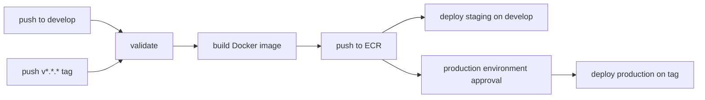

# Architecture

| Field | Value |
| --- | --- |
| Document ID | NWALKER-ARCH-001 |
| Status | Controlled |
| Owner | Nathan Walker |
| Domain | Personal authority site |
| Scope | Runtime, deployment, domain, and documentation architecture for `nwalker.cc` |
| Related Services | Next.js, Docker, AWS ECS Fargate, ECR, ALB, Cloudflare, GitHub Actions |
| Related ADRs | ADR-001 |
| Review Cadence | Monthly while infrastructure is changing |
| Retention Rule | Retain for repository lifetime |
| Last Reviewed | 2026-05-07 |
| Next Review | 2026-06-07 |

## Boundary

`nwalker.cc` is Nathan Walker's personal authority hub. It can link to Ravenhelm, Runestack, Domain Intelligence Schema, Artimetrics, Ravenmask, and personal-project properties, but it is not their runtime, content repository, or brand system of record.

## Runtime

- Application: Next.js 16 app router.
- Styling: global CSS plus generated design tokens.
- Container: Docker image running Next standalone output.
- Hosting: AWS ECS Fargate behind an Application Load Balancer.
- DNS/CDN: Cloudflare for `nwalker.cc` and `staging.nwalker.cc`.

## Deployment Flow

## Data And Events

The site has no application database. The main data sources are typed content modules, static assets, and generated Next.js metadata routes. Deployment evidence lives in GitHub Actions, AWS ECS service state, and external smoke checks.

## Dependencies

- GitHub Actions for CI/CD.
- AWS OIDC role for temporary deployment credentials.
- Terraform for infrastructure definition.
- Cloudflare DNS and proxying.
- 1Password for human-held API tokens and account credentials.

## Cross-Property Architecture

Separate properties should live in separate repos or ownership-specific repositories. Shared conventions should cover metadata, analytics naming, legal footers, DNS policy, uptime checks, redirect rules, and documentation shape.
